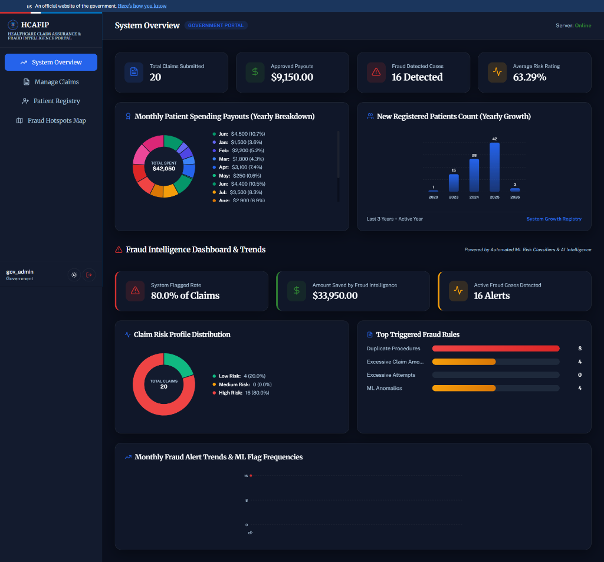
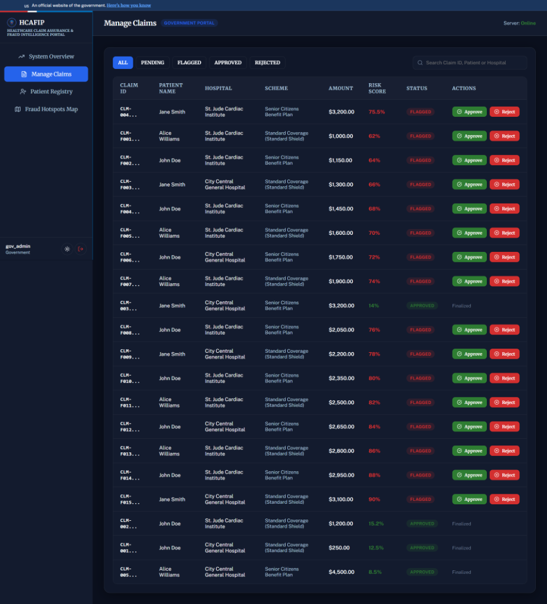
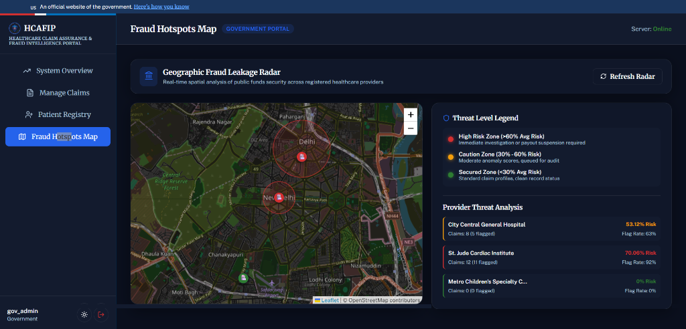
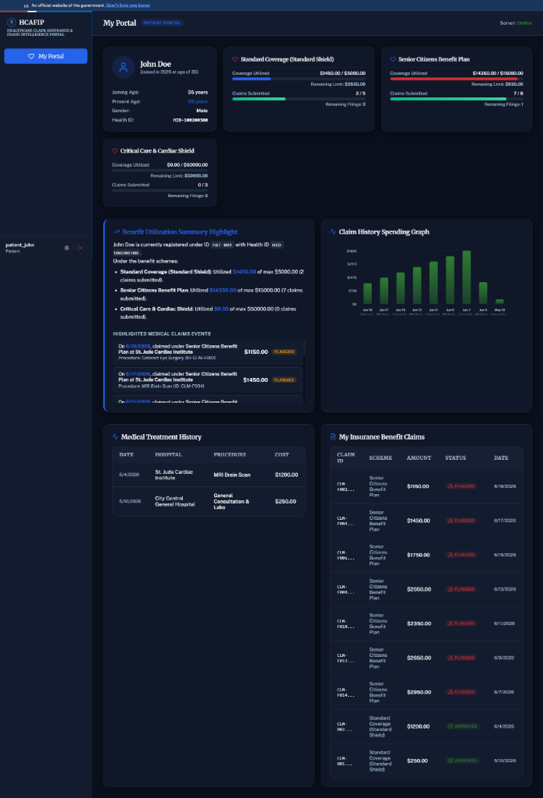

<div align="center">

<!-- Banner GIF -->


# 🏥 HCAFIP
### Healthcare Claim Assurance & Fraud Intelligence Portal


<br/>

<!-- Badges -->
[](https://hcafip-full-stack-healthcare-fraud.vercel.app/)
[](https://hcafip-full-stack-healthcare-fraud.onrender.com/docs)
[](https://github.com/Ajay3699-editor/HCAFIP-full-stack-healthcare-fraud-intelligence-platform)

<br/>

<!-- Branding badges from User -->
<div align="center">
   &nbsp; **Geospatial & AI-Powered Fraud Intelligence** &nbsp; 
  <br/><br/>
  <a href="https://github.com/Ajay3699-editor/HCAFIP-full-stack-healthcare-fraud-intelligence-platform"></a>  
  <a href="https://github.com/Ajay3699-editor/HCAFIP-full-stack-healthcare-fraud-intelligence-platform"></a>
  <a href="https://github.com/Ajay3699-editor/HCAFIP-full-stack-healthcare-fraud-intelligence-platform"></a>  
  <br/>
  <a href="https://github.com/Ajay3699-editor/HCAFIP-full-stack-healthcare-fraud-intelligence-platform"></a>
</div>

<br/>

<!-- Tech Badges -->


</div>

---

## 📌 Table of Contents
* [💡 The Human Story: Why I Built This](#-the-human-story-why-i-built-this)
* [🎬 Project Walkthrough & Video Demo](#-project-walkthrough--video-demo)
* [👥 User Simulation & Interactive Roles](#-user-simulation--interactive-roles)
* [🚀 Key Features](#-key-features)
* [🏗️ System Architecture Flow](#%EF%B8%8F-system-architecture-flow)
* [⚡ Step-by-Step Local Setup](#-step-by-step-local-setup)
* [🔭 Future Scope (Real-World Extensions)](#-future-scope-real-world-extensions)
* [🧪 Automated Tests](#-automated-tests)

---

## 💡 The Human Story: Why I Built This

> *"Every single year, billions in public healthcare funds—hard-earned money paid by taxpayers, meant for the poorest citizens to receive life-saving surgeries and critical treatments—disappear into the black hole of healthcare fraud. Hospitals submit bills for procedures that never occurred. Patient identities are cloned to exhaust benefit balances. While corrupt parties get rich, honest citizens are denied care when they need it most."*

This is not a corporate problem. It is a **human problem** that directly affects families, communities, and human lives.

### The Creator's Vision
As a developer, I wanted to build more than just another portfolio app. I wanted to build a **shield** for public funds. **HCAFIP** was born out of a desire to harness modern AI and Machine Learning to detect fraudulent insurance claims **in real time**, before government money is disbursed. 

By building this, my goal is to show how technology can act as an automated guardian of public funds, ensuring every rupee goes exactly where it is needed: **saving lives.**

<div align="center">
  
</div>

---

## 🎬 Project Walkthrough & Video Demo

Check out the full application walkthrough showing HCAFIP in action detecting fraud, scanning bills, and interacting with Gemini AI:

### 📺 Watch the Total Project Walkthrough Video:
[](https://hcafip-full-stack-healthcare-fraud.vercel.app/)

*(Click the badge above to watch the full walkthrough of the project and see how it works end-to-end!)*

---

## 🚶‍♂️ Step-by-Step Workflow Walkthrough

Here is exactly how the platform secures public healthcare money, visualized through the system portals:

### 1. Government Admin: System Overview & Analytics
*   **What happens**: The Government Admin logs in (`gov_admin` / `admin123`) to access the **System Overview** dashboard. This panel presents real-time aggregate data, including total claims submitted, approved payouts, average risk ratings, and dynamic charts for monthly spending and registered patient growth. It also highlights saved/blocked fraud leakage amounts and a breakdown of triggered fraud rules.
*   **Visual Demonstration**:
    

### 2. Government Admin: Interactive Claim Triage Console
*   **What happens**: The Admin navigates to the **Manage Claims** tab. All claims submitted by hospitals are triaged in real time. Each claim is stamped with patient information, procedural details, and an automated Machine Learning **Risk Score**. The Admin can instantly **Approve** or **Reject** a claim to allow or block payouts.
*   **Visual Demonstration**:
    

### 3. Government Admin: Geospatial Fraud Radar Map
*   **What happens**: The Admin views the **Fraud Hotspots Map**. Powered by Leaflet.js, it translates hospital addresses into geographic coordinates, showing pulsing threat markers (Green = Safe, Orange = Caution, Red = High Risk) and risk radius rings. This allows administrators to quickly identify clusters of systematic regional billing fraud.
*   **Visual Demonstration**:
    

### 4. Patient Portal: Identity Protection & Balance Tracker
*   **What happens**: Patients log in (e.g., `patient_john` / `john123`) to access their **My Portal** dashboard. They can monitor their active government benefit card balances across different schemes, view their medical treatment history, and verify that no fraudulent hospital claims are being processed under their cloned health IDs.
*   **Visual Demonstration**:
    

---

## 👥 User Simulation & Interactive Roles

The application features a robust Role-Based Access Control (RBAC) system. You can try the **[Live Demo](https://hcafip-full-stack-healthcare-fraud.vercel.app/)** with these accounts:

| Role | Username | Password | Purpose & Capabilities |
| :--- | :--- | :--- | :--- |
| 🏛️ **Government Admin** | `gov_admin` | `admin123` | High-level analytics, **Geospatial Fraud Heatmaps**, patient registry, claim approval/rejection |
| 🔍 **Fraud Investigator** | `investigator` | `intel123` | Interactive fraud queue, real-time alert triage, and **Gemini AI chatbot** for specific claim investigations |
| 🏥 **Hospital Provider** | `hosp_city` | `city123` | Submit claims, use **OCR Bill Scanning** to parse files, and view recent submissions |
| 👤 **Patient** | `patient_john` | `john123` | Track your active health scheme balances, check claim status, and ensure your identity isn't being misused |

---

## 🚀 Key Features

### 🤖 Intelligent Fraud Detection
*   **Machine Learning Risk Engine:** Every claim is analyzed by a scikit-learn model upon submission, producing a probability score (0-100) indicating the likelihood of fraud.
*   **Rule-Based Flags:** Flags claims instantly for common red flags, such as duplicate procedures within a short period, exceeding maximum category limits, or mismatched patient records.
*   **Google Gemini AI Assistant:** Integrated chat interface allowing fraud investigators to consult Gemini on complex claims. Gemini parses the claim data, compares historical patient files, and provides an explainable fraud report.

### 🗺️ Interactive Geographic Map
*   **Geospatial Fraud Heatmap:** Visualizes hospital claim distributions, threat rates, and average risk rating on an interactive Leaflet map.
*   **Radar threat levels:** Color-coded pulsing pins indicating high-risk zones, giving government admins a macro-view of systemic leakages.

### 🧾 OCR Medical Bill Scanner
*   Hospitals can upload a receipt or bill photo.
*   The built-in OCR service (powered by Gemini Vision) extracts patient name, treatment type, cost, and dates, pre-filling the claim form automatically to eliminate manual errors and falsified text inputs.

### 📊 Real-Time Analytics & Dashboards
*   **Dynamic Charts:** Displays monthly spend trends, category-wise distributions, fraud alert rates, and hospital rankings.
*   **Scheme Utilization Tracking:** Monitors public health scheme balances in real-time, preventing over-drafting and leakage.

---

## 🏗️ System Architecture Flow

```
                     ┌─────────────────────────────────────────┐
                     │            FRONTEND (Vercel)            │
                     │  React + Vite | Leaflet Maps | Tailwind  │
                     │  RBAC: Admin | Investigator | Hosp | Pat│
                     └────────────────────┬────────────────────┘
                                           │ HTTPS REST API + JWT
                     ┌────────────────────▼────────────────────┐
                     │            BACKEND (Render)             │
                     │ FastAPI | JWT Guard | Pandas Analytics  │
                     ├─────────────────────────────────────────┤
                     │   ML Model    │  Gemini AI   │   OCR    │
                     │ (Scikit-Learn)│ (google-genai) (Pillow) │
                     ├─────────────────────────────────────────┤
                     │             SQLAlchemy ORM              │
                     │         SQLite / PostgreSQL DB          │
                     └─────────────────────────────────────────┘
```

---

## ⚡ Step-by-Step Local Setup

Follow this comprehensive process to run HCAFIP on your local machine:

### 1. Prerequisites
Ensure you have the following installed:
*   **Python 3.11+**
*   **Node.js 18+**
*   A free **[Gemini API Key](https://aistudio.google.com/app/apikey)** from Google AI Studio.

### 2. Clone the Repository
```bash
git clone https://github.com/Ajay3699-editor/HCAFIP-full-stack-healthcare-fraud-intelligence-platform.git
cd HCAFIP-full-stack-healthcare-fraud-intelligence-platform
```

### 3. Configure and Launch Backend
```bash
cd backend

# Create and activate a Python virtual environment
python -m venv venv
venv\Scripts\activate        # On Windows
# source venv/bin/activate   # On Mac/Linux

# Install backend dependencies
pip install -r requirements.txt

# Create environment file
copy .env.example .env       # On Windows
# cp .env.example .env       # On Mac/Linux
```

Open the newly created `.env` file and insert your Gemini API Key:
```env
GEMINI_API_KEY=your_gemini_api_key_here
JWT_SECRET=your_jwt_signing_secret_here
```

Now, start the backend server:
```bash
uvicorn app.main:app --host 127.0.0.1 --port 8001 --reload
```
> The API will be live at: **http://127.0.0.1:8001**  
> View interactive API docs at: **http://127.0.0.1:8001/docs**

### 4. Configure and Launch Frontend
Open a new terminal window at the project root directory:
```bash
cd frontend

# Install Node modules
npm install

# Start the Vite development server
npm run dev
```
> The React app will start at: **http://localhost:5173**

---

## 🔭 Future Scope (Real-World Extensions)

This platform was built to serve as a rock-solid, production-grade foundation. For students, contributors, or engineers looking to take this to a real-world enterprise deployment, here is the roadmap:

*   🔒 **Aadhaar / Identity KYC Integration:** Add multi-factor authentication linking patient logins to official government IDs (e.g., Aadhaar, DigiLocker) to prevent medical identity theft.
*   🔗 **Blockchain Audit Trail:** Log all claim approval and rejection events onto an immutable blockchain ledger (like Hyperledger Fabric), ensuring government auditors can trust every decision history.
*   🗺️ **Advanced Geospatial Analytics:** Build density spatial maps using geo-fencing to detect if patients are claiming benefits from hospitals hundreds of miles away from their registered home coordinates.
*   📊 **Big Data Pipelines:** Upgrade the backend database from SQLite to PostgreSQL and build Apache Spark/Kafka pipelines to scan millions of claims per second.
*   🇮🇳 **Multi-Lingual support:** Localize the portal in Hindi, Telugu, Tamil, and other regional languages to make it accessible to local administrative bodies.
*   📱 **Patient SMS Alerts**: Implement automated WhatsApp/SMS notifications requesting patients to confirm their presence at the hospital when a claim is created.

---

## 🧪 Automated Tests

Keep the codebase robust by running the automated backend test suite:
```bash
cd backend
pytest tests/ -v
```

---

<div align="center">


### Built with passion to protect government healthcare funds 💙
*"The best code you can write is code that makes the world a little more honest."*

<br/>


<br/>

**If this project inspired you or helped you, please give it a ⭐ star!**

[](https://github.com/Ajay3699-editor/HCAFIP-full-stack-healthcare-fraud-intelligence-platform)

</div>
